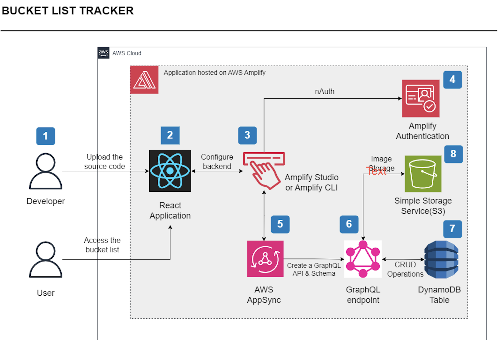
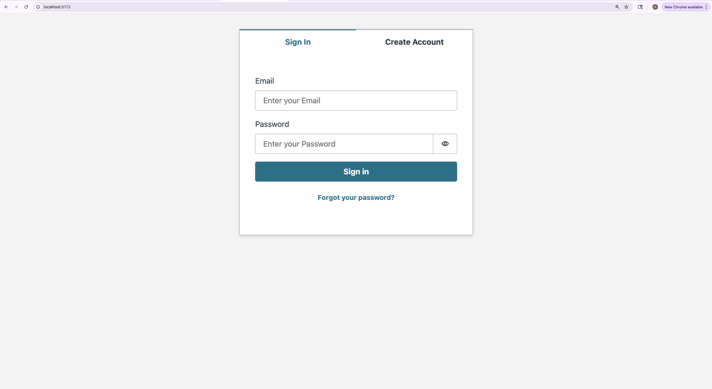
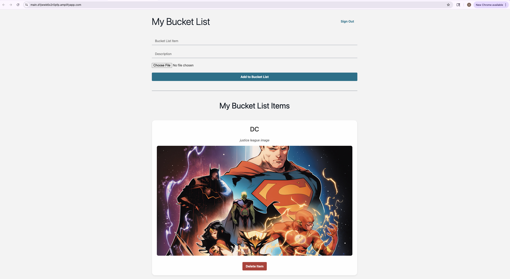
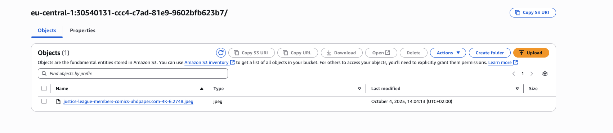

# Bucket List Tracker 

A **serverless, full-stack web application** built with **React** and **AWS Amplify**.  
The app enables users to **create, manage, and track** personal bucket lists with **secure authentication**, **cloud storage**, and a **scalable, real-time backend**.  

---

##  Project Highlights  

- **End-to-End Serverless Architecture:** Combines React frontend with AWS Amplify backend for a fully managed, scalable application.  
- **Secure User Management:** Implemented **email-based signup, login, and verification** with AWS Cognito.  
- **Cloud Data Handling:** GraphQL API via **AWS AppSync** with **DynamoDB** for secure, user-specific data management.  
- **Media Storage:** Users can **upload images** to Amazon S3 with owner-based access control.  
- **CI/CD Deployment:** Automatically deploys frontend and backend on **AWS Amplify Hosting** with GitHub integration.  
- **Responsive & Interactive UI:** Built with **Amplify UI Components** for modern, mobile-friendly design.  

---

##  Key Features  

- **Authentication:** Signup, login, email verification, secure sessions  
- **Bucket List Management:** Create, read, update, delete (CRUD) items  
- **Image Uploads:** Store images per item with private access  
- **Real-Time Updates:** Changes sync automatically for authenticated users  
- **Cloud Deployment:** Fully hosted on AWS Amplify with automated builds  

---

##  Tech Stack  

| **Category**       | **Technology / Service** |
|--------------------|--------------------------|
| **Frontend**       | React, Amplify UI |
| **Backend / API**  | AWS Amplify, AWS AppSync, GraphQL |
| **Database**       | DynamoDB |
| **Storage**        | Amazon S3 |
| **Authentication** | AWS Cognito via Amplify Auth |
| **Hosting / CI-CD**| AWS Amplify Hosting |

---

##  Project Workflow  

1. **React App Setup:** Initialized with **Vite**, structured for scalability.  
2. **GitHub Integration:** Configured version control and CI/CD deployment to Amplify.  
3. **Amplify Backend:**  
   - Configured **Authentication** with Cognito  
   - Built **GraphQL API** with DynamoDB data models  
   - Added **S3 Storage** for secure image uploads  
4. **Frontend Integration:** Connected UI with backend services for **real-time CRUD operations**.  
5. **Deployment:** Deployed to AWS Amplify, enabling live updates with each GitHub push.  
---

## Architectural Diagram
This it the architectural diagram for the project:

---

## Final Results
This is what your project will look like, once built:

---

---

